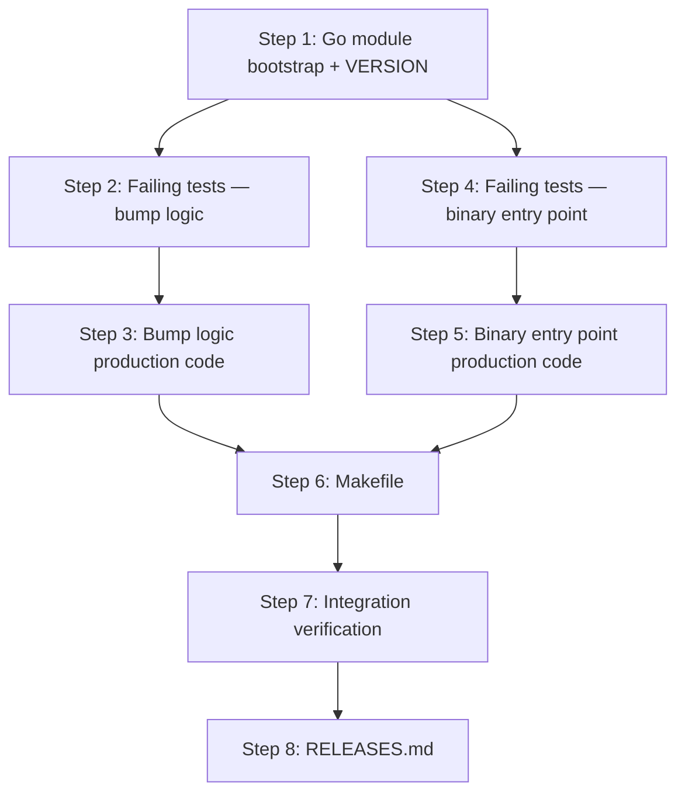

# Implementation Plan: Build pipeline with semantic versioning

**Sprint**: SP-001
**Created**: 2026-06-22
**Spec**: SPEC.md
**Status**: Ready for Implementation

## Summary

This plan delivers the foundational Makefile-based build pipeline for the eve-realm-mcp repository, establishing the `VERSION` file as the single source of truth for semantic versioning. It covers a minimal compilable Go binary entry point in `cmd/eve-realm-mcp/main.go`, `make build` (no ldflags), `make build-prod` (ldflags inject Version/GitHash/BuildDate), `make test`, and version bump targets (`bump-patch`, `bump-minor`, `bump-major`). All implementation follows the Red-Green-Refactor TDD cycle mandated by REQ-001, with test steps interleaved before each production code step.

## Entity Coverage

| Entity  | Type        | Partial | Scope                 |
|---------|-------------|---------|------------------------|
| REQ-006 | requirement | no      | Full implementation    |
| SC-001  | scenario    | no      | Full implementation    |
| SC-002  | scenario    | no      | Full implementation    |
| SC-003  | scenario    | no      | Full implementation    |
| SC-004  | scenario    | no      | Full implementation    |
| SC-005  | scenario    | no      | Full implementation    |
| SC-006  | scenario    | no      | Full implementation    |

## Implementation Steps

### Step 1: Go module bootstrap and VERSION file

**Description**: Initialize the Go module (`go.mod`) declaring `github.com/beduardo/eve-realm-mcp` and wire the SDK submodule via a `replace` directive. Create the `VERSION` file initialized to `0.1.0`. These two files are prerequisites for every subsequent step — `go build`, `go test`, and all Makefile targets depend on them.
**Entities**: REQ-006
**Files to modify**:
- `go.mod` (create)
- `VERSION` (create)
**Acceptance criteria**:
- [ ] `go.mod` declares module `github.com/beduardo/eve-realm-mcp`
- [ ] `go.mod` contains a `replace github.com/beduardo/eve-realm-sdk => ./eve-realm-sdk` directive
- [ ] `VERSION` contains exactly `0.1.0` (no trailing newline ambiguity — must parse cleanly)
**Estimated complexity**: S
**Depends on**: None

---

### Step 2: Failing tests for version bump logic

**Description**: Write the failing Go test file for the version bump utility before any production code exists. Tests cover `bump-patch`, `bump-minor`, and `bump-major` behaviors including patch increment, minor increment with patch reset, major increment with minor and patch reset, sequential bumps, leading-zero safety, and stdout confirmation messages. All tests use `t.TempDir()` for controlled `VERSION` files and table-driven structure. Tests must fail (red) at the end of this step.
**Entities**: REQ-006, SC-003, SC-004, SC-005
**Files to modify**:
- `internal/version/bump_test.go` (create)
**Acceptance criteria**:
- [ ] Test file compiles (the package exists even without production code via a stub or blank file)
- [ ] `go test ./internal/version/...` exits non-zero (all tests fail — red state confirmed)
- [ ] Tests cover `bump-patch`: `0.1.0` → `0.1.1`, `0.1.1` → `0.1.2`
- [ ] Tests cover `bump-minor`: `0.1.3` → `0.2.0`, `0.0.9` → `0.1.0`
- [ ] Tests cover `bump-major`: `0.3.5` → `1.0.0`, `2.7.9` → `3.0.0`
- [ ] Tests cover stdout message: `Version bumped to X.Y.Z`
- [ ] Tests use `t.TempDir()` — no reads from or writes to the real `VERSION` file
- [ ] Table-driven pattern with `t.Run(tc.name, ...)` used throughout
**Estimated complexity**: M
**Depends on**: Step 1

**Test Expectations (from SPEC)**:
- Must test: `bump-patch` increments the patch segment exactly by 1 (e.g., `0.1.0` → `0.1.1`; `0.1.1` → `0.1.2`)
- Must test: `bump-minor` increments the minor segment by 1 and resets patch to `0` (e.g., `0.1.3` → `0.2.0`)
- Must test: `bump-major` increments the major segment by 1 and resets minor and patch to `0` (e.g., `0.3.5` → `1.0.0`)
- Must test: stdout includes the "Version bumped to X.Y.Z" confirmation message
- Must test: VERSION file boundary — bump targets handle leading zeros correctly (no octal interpretation)
- Must NOT rely on: global state, external service availability, or the git state of the test runner's working directory when testing version string parsing

**Testing Approach**: TDD

---

### Step 3: Version bump production logic (green)

**Description**: Implement the `internal/version` package with the `BumpPatch`, `BumpMinor`, and `BumpMajor` functions that read a `VERSION` file path, parse the semver string, increment the appropriate segment, write the result back, and print the confirmation message to stdout. This step makes all tests from Step 2 pass (green). No Makefile wiring yet.
**Entities**: REQ-006, SC-003, SC-004, SC-005
**Files to modify**:
- `internal/version/bump.go` (create)
**Acceptance criteria**:
- [ ] `go test ./internal/version/...` exits zero (all bump tests pass — green state)
- [ ] `BumpPatch`, `BumpMinor`, `BumpMajor` each accept a file path argument (not a global VERSION path)
- [ ] Leading-zero safety confirmed: segments parsed as decimal integers, not octal
- [ ] Confirmation message format: `Version bumped to X.Y.Z` printed to stdout
**Estimated complexity**: M
**Depends on**: Step 2

**Test Expectations (from SPEC)**:
- Must test: `bump-patch` increments the patch segment exactly by 1 (e.g., `0.1.0` → `0.1.1`; `0.1.1` → `0.1.2`)
- Must test: `bump-minor` increments the minor segment by 1 and resets patch to `0` (e.g., `0.1.3` → `0.2.0`)
- Must test: `bump-major` increments the major segment by 1 and resets minor and patch to `0` (e.g., `0.3.5` → `1.0.0`)
- Must test: stdout includes the "Version bumped to X.Y.Z" confirmation message
- Must test: VERSION file boundary — bump targets handle leading zeros correctly (no octal interpretation)

**Testing Approach**: TDD

---

### Step 4: Failing tests for the minimal binary entry point

**Description**: Write failing tests for `cmd/eve-realm-mcp/main.go` before the file exists. Tests cover: default variable values (`Version=dev`, `GitHash=unknown`, `BuildDate=unknown`) when not injected via ldflags, the startup log format `eve-realm-mcp online (v<version>, <hash>, <date>)`, and the `GET /version` HTTP handler returning the correct JSON schema. Tests use `httptest.NewServer` for the HTTP handler and the process substitution pattern for the binary startup log. Tests must be in a failing state at the end of this step.
**Entities**: REQ-006, SC-001, SC-002
**Files to modify**:
- `cmd/eve-realm-mcp/main_test.go` (create)
**Acceptance criteria**:
- [ ] Test file compiles once a stub `main.go` exists (sub-task: create a minimal stub to allow compilation)
- [ ] `go test ./cmd/eve-realm-mcp/...` exits non-zero (red state)
- [ ] Tests cover default variable values: `Version=dev`, `GitHash=unknown`, `BuildDate=unknown`
- [ ] Tests cover `/version` JSON response schema: `{"version":"...","git_hash":"...","build_date":"..."}`
- [ ] Tests cover startup log format: `eve-realm-mcp online (v<version>, <hash>, <date>)`
- [ ] HTTP tests use `httptest.NewServer` — no real bound ports
- [ ] No global state dependencies
**Estimated complexity**: M
**Depends on**: Step 1

**Test Expectations (from SPEC)**:
- Must test: `make build` produces `dist/eve-realm-mcp` that is executable (mode check)
- Must test: binary built without ldflags reports `Version=dev`, `GitHash=unknown`, `BuildDate=unknown` through its startup log or `/version` endpoint
- Must test: the `build` Makefile target recipe does not contain `-ldflags`
- Must test: binary built with `make build-prod` reports the exact version string from the `VERSION` file (not `dev`) via the `/version` endpoint or startup log
- Must test: `main.GitHash` injected matches `git rev-parse --short HEAD` at build time
- Must test: `main.BuildDate` injected is a valid UTC date in `YYYY-MM-DD` format
- Must test: the JSON response from `GET /version` matches the schema `{"version":"...","git_hash":"...","build_date":"..."}`
- Must NOT rely on: a running process or network socket — use `httptest.NewServer` for HTTP handler verification

**Testing Approach**: TDD

---

### Step 5: Minimal binary entry point (green)

**Description**: Implement `cmd/eve-realm-mcp/main.go` with package-level variables `var Version = "dev"`, `var GitHash = "unknown"`, `var BuildDate = "unknown"`, a startup log line in the format `eve-realm-mcp online (v<Version>, <GitHash>, <BuildDate>)`, and an HTTP handler at `/version` returning `{"version":"...","git_hash":"...","build_date":"..."}`. This step makes all tests from Step 4 pass (green). Makefile wiring comes in Step 6.
**Entities**: REQ-006, SC-001, SC-002
**Files to modify**:
- `cmd/eve-realm-mcp/main.go` (create — replaces stub)
**Acceptance criteria**:
- [ ] `go test ./cmd/eve-realm-mcp/...` exits zero (green state)
- [ ] `go build ./cmd/eve-realm-mcp/...` succeeds without errors
- [ ] Package-level variable defaults: `Version="dev"`, `GitHash="unknown"`, `BuildDate="unknown"`
- [ ] Startup log format matches: `eve-realm-mcp online (v<version>, <hash>, <date>)`
- [ ] `/version` handler returns JSON with keys `version`, `git_hash`, `build_date`
**Estimated complexity**: M
**Depends on**: Step 4

**Test Expectations (from SPEC)**:
- Must test: binary built without ldflags reports `Version=dev`, `GitHash=unknown`, `BuildDate=unknown` through its startup log or `/version` endpoint
- Must test: the JSON response from `GET /version` matches the schema `{"version":"...","git_hash":"...","build_date":"..."}`

**Testing Approach**: TDD

---

### Step 6: Makefile with all targets

**Description**: Create the `Makefile` with variables `VERSION`, `GIT_HASH`, `BUILD_DATE` computed via shell at the top, and targets: `build` (no ldflags, output `dist/eve-realm-mcp`), `build-prod` (ldflags inject `main.Version`, `main.GitHash`, `main.BuildDate`), `test` (`go test -count=1 ./...`), `bump-patch` (delegates to the `internal/version` bump logic via a helper or inline shell), `bump-minor`, `bump-major`, and `release-patch` (depends on `test`, then `bump-patch`, then `build-prod`) as the release composition stub. The bump targets print `Version bumped to X.Y.Z` to stdout and update the `VERSION` file.
**Entities**: REQ-006, SC-001, SC-002, SC-006
**Files to modify**:
- `Makefile` (create)
**Acceptance criteria**:
- [ ] `GIT_HASH`, `VERSION`, and `BUILD_DATE` variables computed via shell at the Makefile top
- [ ] `make build` produces `dist/eve-realm-mcp` with no `-ldflags` in the recipe
- [ ] `make build-prod` recipe contains `-ldflags` explicitly referencing `main.Version`, `main.GitHash`, `main.BuildDate`
- [ ] `make test` recipe runs exactly `go test -count=1 ./...`
- [ ] `make bump-patch`, `make bump-minor`, `make bump-major` update `VERSION` and print `Version bumped to X.Y.Z`
- [ ] `release-patch` target declares `test` as a prerequisite (test failure aborts release)
- [ ] `make build` succeeds cleanly on the current repository state
- [ ] `make test` exits zero with all current tests passing
**Estimated complexity**: M
**Depends on**: Step 3, Step 5

**Test Expectations (from SPEC)**:
- Must test: `make build` produces `dist/eve-realm-mcp` that is executable (mode check)
- Must test: the `build` Makefile target recipe does not contain `-ldflags`
- Must test: `make build-prod` injects `main.Version` matching the content of `VERSION`, `main.GitHash` matching the short git HEAD, and `main.BuildDate` matching the UTC date
- Must test: the `test` Makefile recipe runs `go test -count=1 ./...` (not a different invocation)
- Must test: the `release-patch` target declares `test` as a prerequisite
- Must test: when a test file contains a `t.Fatal` call, `make test` exits with code 1

**Testing Approach**: TDD

---

### Step 7: Integration verification — build and test pipeline end-to-end

**Description**: Write integration-level tests that exercise the full Makefile pipeline as a black box: verify `make build` produces an executable binary at `dist/eve-realm-mcp` without ldflags, verify `make build-prod` injects the correct version values from `VERSION` and git HEAD, verify `make test` exits non-zero when a `t.Fatal` test is injected, and verify that `release-patch` aborts when tests fail. These tests complement the unit tests from Steps 2-5 and validate the end-to-end pipeline integration.
**Entities**: REQ-006, SC-001, SC-002, SC-006
**Files to modify**:
- `internal/version/integration_test.go` (create)
**Acceptance criteria**:
- [ ] Test verifies `dist/eve-realm-mcp` is executable after `make build` (file mode check)
- [ ] Test verifies `dist/eve-realm-mcp` binary reports `dev`/`unknown`/`unknown` defaults after `make build`
- [ ] Test verifies `make build-prod` binary reports version matching `VERSION` file content
- [ ] Test verifies `make build-prod` binary reports `BuildDate` as a valid `YYYY-MM-DD` string
- [ ] Test verifies `make test` exits code 1 when a `t.Fatal` file is injected into a temp package
- [ ] All tests pass: `go test ./...` exits zero
**Estimated complexity**: M
**Depends on**: Step 6

**Test Expectations (from SPEC)**:
- Must test: `make build` produces `dist/eve-realm-mcp` that is executable (mode check)
- Must test: binary built without ldflags reports `Version=dev`, `GitHash=unknown`, `BuildDate=unknown`
- Must test: `make build-prod` injects `main.Version` matching the content of `VERSION`
- Must test: `main.BuildDate` injected is a valid UTC date in `YYYY-MM-DD` format
- Must test: when a test file contains a `t.Fatal` call, `make test` exits with code 1
- Must NOT rely on: permanently mutating the test suite — use a temporary test file injected during the test run or verify Makefile dependency structure through static inspection

**Testing Approach**: TDD

---

### Step 8: RELEASES.md Append

**Description**: Append a release entry to `RELEASES.md` documenting the SP-001 sprint delivery. The entry includes the sprint ID and title, the date of completion, a summary of changes delivered (VERSION file, Makefile build pipeline, ldflags version injection, minimal binary entry point), and all entity IDs included in the sprint.
**Entities**: REQ-006, SC-001, SC-002, SC-003, SC-004, SC-005, SC-006
**Files to modify**:
- `RELEASES.md` (create — first entry)
**Acceptance criteria**:
- [ ] `RELEASES.md` has a new entry with sprint ID `SP-001` and the completion date
- [ ] Entry lists all entity IDs delivered: REQ-006, SC-001, SC-002, SC-003, SC-004, SC-005, SC-006
- [ ] Entry summarizes changes in 2-3 sentences covering the VERSION file, Makefile targets, ldflags injection, and minimal binary
- [ ] Existing entries are not read or modified (this is the first entry, so the file is created fresh)
**Estimated complexity**: S
**Depends on**: Step 7

---

## Step Dependency Graph

---

## Pinned Entity Compliance

| Entity | Directive | How Addressed |
|--------|-----------|---------------|
| REQ-005: Cross-cutting requirements catalog for lazy-loaded sprint policy injection | Plan generator MUST call `eve_software_show <ID>` for each matching trigger before proceeding. Plan propagates test expectations and enforces test-first step ordering per REQ-001 pipeline integration instructions. | REQ-001 and REQ-002 triggers both evaluated as matching. REQ-001 loaded: Test Expectations propagated to Steps 2-7; TDD testing strategy enforced via interleaved test steps (Steps 2 and 4 write failing tests before Steps 3 and 5 write production code). REQ-002 loaded: RELEASES.md step included as Step 8 with patch increment (0.1.0 → 0.1.1) recorded; README update not required so no README step included. REQ-003 and REQ-004 evaluated as not matching — no K8s or inter-pod changes in scope. |
