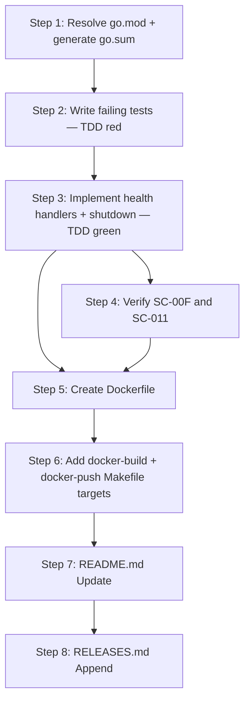

# Implementation Plan: Docker image build and minimal MCP Server binary

**Sprint**: SP-002
**Created**: 2026-06-22
**Spec**: SPEC.md
**Status**: Ready for Implementation

## Summary

SP-002 completes the MCP Server scaffold by extending the existing binary with health probe endpoints (`/healthz`, `/readyz`) and graceful SIGINT/SIGTERM shutdown, then packages it as a versioned distroless Docker image pushed to the local k3d registry. The plan resolves two mandatory preconditions first (removing the unused SDK module directive and generating `go.sum`), then follows TDD ordering — tests are written before production code for all new functionality — before wiring the Dockerfile and Makefile docker targets. The result is a deployable, version-tagged image ready to accept K8s liveness and readiness probes.

## Entity Coverage

| Entity  | Type        | Partial | Scope                  |
|---------|-------------|---------|------------------------|
| REQ-007 | requirement | no      | Full implementation    |
| REQ-009 | requirement | no      | Full implementation (ACs 4, 5, 8 new; ACs 1-3, 6-7 verify-only from SP-001) |
| SC-007  | scenario    | no      | Full implementation    |
| SC-008  | scenario    | no      | Full implementation    |
| SC-009  | scenario    | no      | Full implementation    |
| SC-00F  | scenario    | no      | Verify-only (SP-001 delivered) |
| SC-010  | scenario    | no      | Full implementation    |
| SC-011  | scenario    | no      | Verify-only (SP-001 delivered) |
| SC-012  | scenario    | no      | Full implementation    |

## Implementation Steps

### Step 1: Resolve go.mod and generate go.sum

**Description**: Remove the unused `require github.com/beduardo/eve-realm-sdk` and `replace` directives from `go.mod` since `cmd/eve-realm-mcp/main.go` currently has zero SDK imports. Run `go mod tidy` to generate `go.sum`. This resolves Caveats 1 and 2 from the spec and is a hard prerequisite for every subsequent Docker build step. Commit both `go.mod` and `go.sum`.
**Entities**: REQ-007, SC-007
**Files to modify**:
- `/Users/bruno/repo-pessoal/eve-realm/eve-realm-mcp/main/go.mod` (modify — remove SDK require/replace directives)
- `/Users/bruno/repo-pessoal/eve-realm/eve-realm-mcp/main/go.sum` (create — via `go mod tidy`)
**Acceptance criteria**:
- [ ] `go.mod` no longer contains `require github.com/beduardo/eve-realm-sdk` or `replace github.com/beduardo/eve-realm-sdk`
- [ ] `go.sum` exists at the repository root
- [ ] `go mod tidy` exits 0 with no errors
- [ ] `go build ./cmd/eve-realm-mcp` succeeds after the change
- [ ] `go test ./...` passes with no failures
**Estimated complexity**: S
**Depends on**: None

---

### Step 2: Write failing tests for health handlers and graceful shutdown (TDD red phase)

**Description**: Extend `cmd/eve-realm-mcp/main_test.go` with the full test suite for the three new behaviours — `HealthzHandler()`, `ReadyzHandler()`, and graceful shutdown — before any production code is written. Tests must use `httptest.NewServer` for handler unit tests and must not rely on real OS signals for the shutdown test. All new tests must fail (red) at the end of this step because the handlers and shutdown logic do not yet exist.
**Entities**: REQ-009, SC-010, SC-012
**Files to modify**:
- `/Users/bruno/repo-pessoal/eve-realm/eve-realm-mcp/main/cmd/eve-realm-mcp/main_test.go` (modify — extend with new test functions)
**Acceptance criteria**:
- [ ] `TestHealthzHandler` exists and tests: status 200, `Content-Type: application/json`, decoded body `{"status":"ok"}`
- [ ] `TestReadyzHandler` exists and tests: status 200, `Content-Type: application/json`, decoded body `{"status":"ok"}`
- [ ] Graceful shutdown test exists and verifies: shutdown log message `eve-realm-mcp shutting down` is emitted, `http.Server.ListenAndServe` returns `http.ErrServerClosed`, no panic
- [ ] Shutdown test does NOT use `syscall.SIGINT` or `syscall.SIGTERM` — uses context cancellation or direct `server.Shutdown` call
- [ ] `go test ./cmd/eve-realm-mcp/...` fails (red) at end of this step due to missing `HealthzHandler`, `ReadyzHandler`, and shutdown logic
- [ ] Pre-existing tests (`TestVersionHandler*`, `TestStartupMessage*`, `TestDefaultVariable*`) continue to pass
**Estimated complexity**: M
**Depends on**: Step 1

**Test Expectations (from SPEC)**:
- Must test: `GET /healthz` on `httptest.NewServer` returns status 200, `Content-Type: application/json`, decoded body `{"status":"ok"}`
- Must test: `GET /readyz` on `httptest.NewServer` returns status 200, `Content-Type: application/json`, decoded body `{"status":"ok"}`
- Must test: on receiving shutdown signal, the server logs `eve-realm-mcp shutting down` and the HTTP server stops accepting new connections
- Must test: graceful shutdown completes without panic and exits cleanly
- Must NOT rely on: real OS signals (`syscall.SIGINT`) in unit tests — use channel or context cancellation to trigger shutdown path in the test
- Must test: when `server.Shutdown` is called, the HTTP server stops accepting new connections and the shutdown log message `eve-realm-mcp shutting down` is emitted
- Must test: after shutdown, `http.Server.ListenAndServe` returns `http.ErrServerClosed`
- Must test: exit is clean — no panic, goroutine leak, or error propagation
- Must NOT rely on: real `syscall.SIGINT` or `syscall.SIGTERM` in unit tests — trigger shutdown via context cancellation or direct `server.Shutdown` call

**Testing Approach**: TDD

---

### Step 3: Implement health handlers and graceful shutdown (TDD green phase)

**Description**: Extend `cmd/eve-realm-mcp/main.go` in place (never recreate) with `HealthzHandler()` and `ReadyzHandler()` constructor functions following the same pattern as `VersionHandler()`. Replace `http.ListenAndServe` in `main()` with an explicit `http.Server` struct combined with `signal.NotifyContext(context.Background(), os.Interrupt, syscall.SIGTERM)` and `server.Shutdown(ctx)`, emitting the `eve-realm-mcp shutting down` log line before shutdown. Register `/healthz` and `/readyz` routes in `main()`. All tests written in Step 2 must turn green.
**Entities**: REQ-009, SC-010, SC-012
**Files to modify**:
- `/Users/bruno/repo-pessoal/eve-realm/eve-realm-mcp/main/cmd/eve-realm-mcp/main.go` (modify — add `HealthzHandler`, `ReadyzHandler`, `healthResponse` struct, refactor `main()` shutdown loop)
**Acceptance criteria**:
- [ ] `HealthzHandler()` returns `http.Handler` that sets `Content-Type: application/json`, writes HTTP 200, and encodes `{"status":"ok"}`
- [ ] `ReadyzHandler()` returns `http.Handler` with identical behaviour to `HealthzHandler()`
- [ ] `/healthz` and `/readyz` are registered in `main()` via `mux.Handle`
- [ ] `main()` uses `http.Server` struct — `http.ListenAndServe` is no longer called directly
- [ ] On signal receipt, binary logs `eve-realm-mcp shutting down` before calling `server.Shutdown`
- [ ] `go test ./cmd/eve-realm-mcp/...` passes (green) — all tests from Step 2 pass
- [ ] `go test ./...` passes in full — no regressions on SP-001 tests
- [ ] `go build ./cmd/eve-realm-mcp` succeeds
**Estimated complexity**: M
**Depends on**: Step 2

**Testing Approach**: TDD

---

### Step 4: Verify SC-00F and SC-011 (verify-only scenarios)

**Description**: Confirm that the SP-001 scenarios for binary startup and version endpoint remain fully satisfied after the SP-002 changes to `main.go`. Run `go test ./...` and spot-check that the binary starts on port 8080 by default and that `GET /version` still returns the correct JSON schema. No new production code or test code is written in this step.
**Entities**: SC-00F, SC-011
**Files to modify**:
- None (verification only)
**Acceptance criteria**:
- [ ] `go test ./...` exits 0 with no failures
- [ ] `go build -o dist/eve-realm-mcp ./cmd/eve-realm-mcp` succeeds without ldflags
- [ ] Running the binary without flags starts on port 8080 and logs `eve-realm-mcp online (vdev, unknown, unknown)`
- [ ] `GET /version` on the running binary returns HTTP 200, `Content-Type: application/json`, and a body containing `version`, `git_hash`, and `build_date` keys
- [ ] `make build-prod` injects version from `VERSION` file and `GET /version` returns `{"version":"0.1.0",...}`
**Estimated complexity**: S
**Depends on**: Step 3

---

### Step 5: Create Dockerfile

**Description**: Create the two-stage Dockerfile at the repository root following the eve-cli pattern. Stage `builder` uses `golang:1.25-alpine` with `CGO_ENABLED=0` and ldflags for version injection, copies `go.mod`/`go.sum` first, runs `go mod download`, then copies source and builds `./cmd/eve-realm-mcp` to `/out/eve-realm-mcp`. The runtime stage uses `gcr.io/distroless/static-debian12:nonroot`, copies the binary to `/usr/local/bin/eve-realm-mcp`, exposes port 8080, and sets the entrypoint. The `VERSION` build arg must be declared and threaded through the ldflags.
**Entities**: REQ-007, SC-007, SC-008
**Files to modify**:
- `/Users/bruno/repo-pessoal/eve-realm/eve-realm-mcp/main/Dockerfile` (create)
**Acceptance criteria**:
- [ ] Dockerfile exists at repository root
- [ ] Stage one is named `builder` and uses `golang:1.25-alpine`
- [ ] Stage one declares `ARG VERSION` and uses it in ldflags: `-X main.Version=$VERSION`
- [ ] Stage one copies `go.mod` and `go.sum` before any source, then runs `go mod download`
- [ ] Stage one builds with `CGO_ENABLED=0` and outputs binary to `/out/eve-realm-mcp`
- [ ] Stage two uses `gcr.io/distroless/static-debian12:nonroot`
- [ ] Stage two copies binary to `/usr/local/bin/eve-realm-mcp`
- [ ] `EXPOSE 8080` is declared in the runtime stage
- [ ] `ENTRYPOINT ["/usr/local/bin/eve-realm-mcp"]` is set in the runtime stage
- [ ] `docker build --build-arg VERSION=0.1.0 -t eve-realm-mcp:test .` succeeds from repository root
- [ ] `docker run --rm -p 8081:8080 eve-realm-mcp:test` starts and `GET http://localhost:8081/healthz` returns HTTP 200
**Estimated complexity**: S
**Depends on**: Step 3, Step 4

**Test Expectations (from SPEC)**:
- Must test: `docker build` succeeds from repository root with `--build-arg VERSION=0.1.0`
- Must test: `docker history` confirms two build stages
- Must test: `docker run --rm -p 8080:8080 eve-realm-mcp:test` starts and `GET /healthz` returns 200
- Must NOT rely on: k3d registry connectivity for this scenario — use a local image tag (`eve-realm-mcp:test`)
- Must test: the runtime image contains only the binary at `/usr/local/bin/eve-realm-mcp` and no Go toolchain artifacts

**Testing Approach**: TDD

---

### Step 6: Add docker-build and docker-push Makefile targets

**Description**: Extend the Makefile with the `DOCKER_IMAGE` variable and `docker-build`, `docker-push` targets. `docker-build` must pass `--build-arg VERSION=$(VERSION)` and tag the image as `$(DOCKER_IMAGE):$(VERSION)`. `docker-push` must push only the versioned tag. Both targets must be added to `.PHONY`. Follow the existing variable naming and lower-hyphen-case target conventions established in SP-001.
**Entities**: REQ-007, SC-008, SC-009
**Files to modify**:
- `/Users/bruno/repo-pessoal/eve-realm/eve-realm-mcp/main/Makefile` (modify — add `DOCKER_IMAGE` variable, `docker-build` target, `docker-push` target, extend `.PHONY`)
**Acceptance criteria**:
- [ ] `DOCKER_IMAGE` variable is defined at the top of the Makefile with value `k3d-eve-realm-registry.localhost:5100/eve-realm-mcp`
- [ ] `docker-build` target calls `docker build --build-arg VERSION=$(VERSION) -t $(DOCKER_IMAGE):$(VERSION) .`
- [ ] `docker-push` target calls `docker push $(DOCKER_IMAGE):$(VERSION)` — versioned tag only, no `:latest`
- [ ] Both `docker-build` and `docker-push` appear in the `.PHONY` declaration
- [ ] `make docker-build` exits 0 and a local image tagged `k3d-eve-realm-registry.localhost:5100/eve-realm-mcp:0.1.0` exists (given `VERSION=0.1.0`)
- [ ] `GET /version` on the container built by `make docker-build` returns `{"version":"0.1.0",...}`, confirming the `VERSION` build arg propagated through ldflags
**Estimated complexity**: S
**Depends on**: Step 5

**Test Expectations (from SPEC)**:
- Must test: `make docker-build` exits 0 and produces an image with the tag matching `$(DOCKER_IMAGE):$(VERSION)`
- Must test: the `VERSION` build arg is propagated — `GET /version` on the container returns `"version":"0.1.0"`
- Must test: `make docker-push` succeeds when the k3d registry is reachable and the versioned image exists locally
- Must test: registry API confirms the pushed tag via `v2/eve-realm-mcp/tags/list`

**Testing Approach**: TDD

---

### Step 7: README.md Update

**Description**: Update `README.md` to reflect the user-facing changes delivered in SP-002: the new `docker-build` and `docker-push` Makefile targets, the new `/healthz` and `/readyz` HTTP endpoints, graceful SIGINT/SIGTERM shutdown behaviour, and the Docker image naming convention at `k3d-eve-realm-registry.localhost:5100/eve-realm-mcp:<VERSION>`.
**Entities**: REQ-007, REQ-009, SC-007, SC-008, SC-009, SC-010, SC-011, SC-012
**Files to modify**:
- `/Users/bruno/repo-pessoal/eve-realm/eve-realm-mcp/main/README.md` (modify)
**Acceptance criteria**:
- [ ] README.md documents `make docker-build` (builds versioned Docker image) and `make docker-push` (pushes to k3d registry at `k3d-eve-realm-registry.localhost:5100`)
- [ ] README.md documents `GET /healthz` and `GET /readyz` endpoints — both return `{"status":"ok"}` HTTP 200 — as K8s liveness and readiness probe targets
- [ ] README.md documents graceful shutdown: binary handles SIGINT and SIGTERM, logs `eve-realm-mcp shutting down` before clean exit
- [ ] README.md documents the Docker image name pattern: `k3d-eve-realm-registry.localhost:5100/eve-realm-mcp:<VERSION>`, distroless runtime, entrypoint at `/usr/local/bin/eve-realm-mcp`
- [ ] README.md is consistent with the implementation delivered in Steps 1-6
**Estimated complexity**: S
**Depends on**: Steps 1-6

---

### Step 8: RELEASES.md Append

**Description**: Append a release entry to `RELEASES.md` documenting SP-002's delivery: health probe endpoints, graceful shutdown, two-stage Dockerfile, and Makefile docker targets. Do not modify any existing entries.
**Entities**: REQ-007, REQ-009, SC-007, SC-008, SC-009, SC-00F, SC-010, SC-011, SC-012
**Files to modify**:
- `/Users/bruno/repo-pessoal/eve-realm/eve-realm-mcp/main/RELEASES.md` (modify — append only)
**Acceptance criteria**:
- [ ] RELEASES.md has a new entry with sprint ID `SP-002` and date field
- [ ] Entry lists all entity IDs: REQ-007, REQ-009, SC-007, SC-008, SC-009, SC-00F, SC-010, SC-011, SC-012
- [ ] Entry summarizes changes: health probe endpoints (`/healthz`, `/readyz`), graceful SIGINT/SIGTERM shutdown, two-stage Dockerfile (golang:1.25-alpine builder + distroless runtime), Makefile targets `docker-build` and `docker-push`
- [ ] Existing SP-001 entry is unchanged
**Estimated complexity**: S
**Depends on**: Steps 1-7

---

## Step Dependency Graph

---

## Pinned Entity Compliance

| Entity | Directive | How Addressed |
|--------|-----------|---------------|
| REQ-005: Cross-cutting requirements catalog for lazy-loaded sprint policy injection | Plan generator must ensure steps follow TDD ordering (REQ-001), include release steps (REQ-002), reference k3d topology (REQ-004) where applicable, and defer REQ-003 cluster checks to the deployment sprint per the spec. | TDD ordering enforced: Step 2 writes failing tests before Step 3 writes production code for all new Go functionality (REQ-001). Release steps included: Step 7 (README.md) and Step 8 (RELEASES.md) (REQ-002). k3d topology referenced: `DOCKER_IMAGE` defaults to `k3d-eve-realm-registry.localhost:5100/eve-realm-mcp`, port 8080, namespace `eve-realm` noted throughout (REQ-004). REQ-003 cluster check functions for `/healthz` and `/readyz` explicitly deferred to the deployment sprint (REQ-008) — out of scope per spec. |
