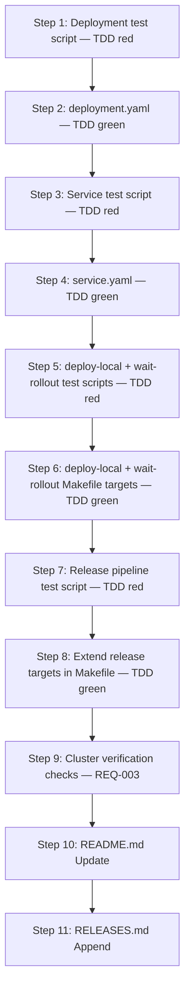

# Implementation Plan: K8s deployment manifests and local deploy pipeline

**Sprint**: SP-003
**Created**: 2026-06-22
**Spec**: SPEC.md
**Status**: Ready for Implementation

## Summary

SP-003 delivers the Kubernetes deployment manifests (`deploy/k8s/deployment.yaml`, `deploy/k8s/service.yaml`) that bring the MCP Server into the `eve-realm` namespace on the local k3d cluster, together with Makefile targets `deploy-local`, `wait-rollout`, and extended release pipelines (`release-patch`, `release-minor`, `release-major`). With this sprint complete, a single `make release-patch` command orchestrates the full seven-step pipeline — `test → bump-patch → build-prod → docker-build → docker-push → deploy-local → wait-rollout` — closing the loop between code change and a running, version-verified cluster pod. A cluster verification step wires the five affected cluster surfaces (Deployment readiness, Service availability, `/healthz`, `/readyz`, and ConfigMap injection) into the REQ-003 check suite.

## Entity Coverage

| Entity  | Type        | Partial | Scope                  |
|---------|-------------|---------|------------------------|
| REQ-008 | requirement | no      | Full implementation    |
| SC-00A  | scenario    | no      | Full implementation    |
| SC-00B  | scenario    | no      | Full implementation    |
| SC-00C  | scenario    | no      | Full implementation    |
| SC-00D  | scenario    | no      | Full implementation    |
| SC-00E  | scenario    | no      | Full implementation    |

## Implementation Steps

### Step 1: Create K8s deployment manifest (TDD red — dry-run validation)

**Description**: Write the failing test script and validation harness for `deploy/k8s/deployment.yaml` before the manifest exists. The test uses `kubectl apply --dry-run=client -f -` and `yq`/`python3 -c` YAML parsing to assert name, namespace, labels, image tag containing `VERSION_PLACEHOLDER`, ports 8080 and 50051, `envFrom` referencing `eve-realm-config`, liveness/readiness probe paths and settings, and resource requests/limits. Running the test suite at the end of this step must fail (red) because the manifest does not exist yet. This satisfies the TDD red phase for SC-00A and all manifest-structural acceptance criteria in REQ-008.

**Entities**: REQ-008, SC-00A
**Files to modify**:
- `deploy/k8s/` (create directory)
- `deploy/k8s/tests/validate-deployment.sh` (create — shell test script for manifest validation)
**Acceptance criteria**:
- [ ] `deploy/k8s/` directory exists
- [ ] `deploy/k8s/tests/validate-deployment.sh` exists and contains assertions for: name `eve-realm-mcp`, namespace `eve-realm`, labels `app: eve-realm-mcp` and `app.kubernetes.io/part-of: eve-realm`, image tag `VERSION_PLACEHOLDER`, ports 8080 and 50051, `envFrom` ConfigMap ref `eve-realm-config`, liveness probe path `/healthz` port 8080 with `initialDelaySeconds: 5 periodSeconds: 10 failureThreshold: 3`, readiness probe path `/readyz` port 8080 with `initialDelaySeconds: 3 periodSeconds: 5 failureThreshold: 3`, resource requests `128Mi`/`100m` and limits `256Mi`/`250m`
- [ ] Running `deploy/k8s/tests/validate-deployment.sh` exits non-zero (red) because `deploy/k8s/deployment.yaml` does not yet exist
- [ ] Script uses `kubectl apply --dry-run=client` for structural validation — does not require a live cluster
**Estimated complexity**: S
**Depends on**: None

**Test Expectations (from SPEC)**:
- Must test: the manifest YAML is parseable and `kubectl apply --dry-run=client` exits 0
- Must test: liveness probe path is `/healthz` and readiness probe path is `/readyz`, both targeting port 8080
- Must test: resource limits and requests match the specified values (128Mi/100m requests, 256Mi/250m limits)
- Must NOT rely on: a live running pod — all checks must use `kubectl --dry-run=client` or static YAML parsing

**Testing Approach**: TDD

---

### Step 2: Author deployment.yaml (TDD green)

**Description**: Create `deploy/k8s/deployment.yaml` with all fields required by REQ-008 AC-1 through AC-7 and SC-00A AC-1 through AC-7. The manifest defines a Deployment named `eve-realm-mcp` in namespace `eve-realm`, image `k3d-eve-realm-registry.localhost:5100/eve-realm-mcp:VERSION_PLACEHOLDER`, ports 8080 (HTTP) and 50051 (gRPC), `envFrom` referencing the `eve-realm-config` ConfigMap, liveness probe HTTP GET `/healthz` on port 8080 with `initialDelaySeconds: 5 / periodSeconds: 10 / failureThreshold: 3`, readiness probe HTTP GET `/readyz` on port 8080 with `initialDelaySeconds: 3 / periodSeconds: 5 / failureThreshold: 3`, and resource requests 128Mi/100m with limits 256Mi/250m. Running the test script from Step 1 must exit 0 (green).

**Entities**: REQ-008, SC-00A
**Files to modify**:
- `deploy/k8s/deployment.yaml` (create)
**Acceptance criteria**:
- [ ] `deploy/k8s/deployment.yaml` exists and is valid YAML
- [ ] `kubectl apply --dry-run=client -f deploy/k8s/deployment.yaml` exits 0 with no validation errors
- [ ] Deployment name is `eve-realm-mcp`, namespace is `eve-realm`
- [ ] Labels include `app: eve-realm-mcp` and `app.kubernetes.io/part-of: eve-realm` on both the Deployment metadata and the pod template
- [ ] Container image is `k3d-eve-realm-registry.localhost:5100/eve-realm-mcp:VERSION_PLACEHOLDER`
- [ ] Container ports 8080 and 50051 are declared
- [ ] `envFrom` references ConfigMap `eve-realm-config`
- [ ] Liveness probe: HTTP GET `/healthz` port 8080, `initialDelaySeconds: 5`, `periodSeconds: 10`, `failureThreshold: 3`
- [ ] Readiness probe: HTTP GET `/readyz` port 8080, `initialDelaySeconds: 3`, `periodSeconds: 5`, `failureThreshold: 3`
- [ ] Resource requests: `memory: 128Mi`, `cpu: 100m`; limits: `memory: 256Mi`, `cpu: 250m`
- [ ] `deploy/k8s/tests/validate-deployment.sh` exits 0 (green) — all assertions pass
**Estimated complexity**: S
**Depends on**: Step 1

**Testing Approach**: TDD

---

### Step 3: Create K8s service manifest (TDD red — dry-run validation)

**Description**: Write the failing test script for `deploy/k8s/service.yaml` before the manifest exists. The test uses `kubectl apply --dry-run=client` and static YAML parsing to assert name `eve-realm-mcp`, namespace `eve-realm`, labels, type `ClusterIP`, selector `app: eve-realm-mcp`, port 8080 named `http` with targetPort 8080, and port 50051 named `grpc` with targetPort 50051. The script also cross-validates that the Service selector matches the pod template labels in `deployment.yaml`. Running the test at the end of this step must fail (red) because `service.yaml` does not yet exist.

**Entities**: REQ-008, SC-00B
**Files to modify**:
- `deploy/k8s/tests/validate-service.sh` (create — shell test script for service manifest validation)
**Acceptance criteria**:
- [ ] `deploy/k8s/tests/validate-service.sh` exists and contains assertions for: name `eve-realm-mcp`, namespace `eve-realm`, labels `app: eve-realm-mcp` and `app.kubernetes.io/part-of: eve-realm`, type `ClusterIP`, selector `app: eve-realm-mcp`, port 8080 named `http` targetPort 8080, port 50051 named `grpc` targetPort 50051
- [ ] Script cross-validates that Service selector matches pod template labels in `deploy/k8s/deployment.yaml`
- [ ] Running `deploy/k8s/tests/validate-service.sh` exits non-zero (red) because `deploy/k8s/service.yaml` does not yet exist
- [ ] Script uses `kubectl apply --dry-run=client` — does not require a live cluster
**Estimated complexity**: S
**Depends on**: Step 2

**Test Expectations (from SPEC)**:
- Must test: the service YAML is parseable and `kubectl apply --dry-run=client` exits 0
- Must test: port 8080 is named `http` and port 50051 is named `grpc` in the ports list
- Must test: selector `app: eve-realm-mcp` matches the pod template labels declared in `deployment.yaml`
- Must NOT rely on: a running cluster — all checks use `kubectl --dry-run=client` or static YAML parsing

**Testing Approach**: TDD

---

### Step 4: Author service.yaml (TDD green)

**Description**: Create `deploy/k8s/service.yaml` satisfying REQ-008 AC-8 and SC-00B AC-1 through AC-6. The manifest defines a ClusterIP Service named `eve-realm-mcp` in namespace `eve-realm` with selector `app: eve-realm-mcp`, port 8080 named `http` targeting port 8080, and port 50051 named `grpc` targeting port 50051. Running the test script from Step 3 must exit 0 (green).

**Entities**: REQ-008, SC-00B
**Files to modify**:
- `deploy/k8s/service.yaml` (create)
**Acceptance criteria**:
- [ ] `deploy/k8s/service.yaml` exists and is valid YAML
- [ ] `kubectl apply --dry-run=client -f deploy/k8s/service.yaml` exits 0
- [ ] Service name is `eve-realm-mcp`, namespace is `eve-realm`
- [ ] Labels include `app: eve-realm-mcp` and `app.kubernetes.io/part-of: eve-realm`
- [ ] Spec type is `ClusterIP`
- [ ] Selector is `app: eve-realm-mcp`
- [ ] Port 8080 is named `http` with `targetPort: 8080`
- [ ] Port 50051 is named `grpc` with `targetPort: 50051`
- [ ] `deploy/k8s/tests/validate-service.sh` exits 0 (green) — all assertions including selector cross-validation pass
**Estimated complexity**: S
**Depends on**: Step 3

**Testing Approach**: TDD

---

### Step 5: Write failing tests for deploy-local and wait-rollout Makefile targets (TDD red)

**Description**: Write shell test scripts that verify the `deploy-local` and `wait-rollout` Makefile target recipes without a live cluster. For `deploy-local`: inspect the Makefile recipe to confirm `VERSION_PLACEHOLDER` is replaced via `sed -e` (portable BSD/GNU form) and that both manifest files are piped to `kubectl apply`; use a mock `kubectl` stub that records invocations and asserts the processed manifest contains the actual version string rather than `VERSION_PLACEHOLDER`. For `wait-rollout`: inspect the Makefile recipe and assert it passes `rollout status deployment/eve-realm-mcp -n eve-realm --timeout=120s` to `kubectl` and propagates exit codes. Both test scripts must exit non-zero (red) because the Makefile targets do not exist yet.

**Entities**: REQ-008, SC-00C, SC-00D
**Files to modify**:
- `deploy/k8s/tests/validate-deploy-local.sh` (create — mock-kubectl test for deploy-local target)
- `deploy/k8s/tests/validate-wait-rollout.sh` (create — exit-code propagation test for wait-rollout target)
**Acceptance criteria**:
- [ ] `validate-deploy-local.sh` exists and asserts: `make deploy-local` reads `VERSION` file, replaces `VERSION_PLACEHOLDER` with the version string using portable `sed -e`, applies both `deployment.yaml` and `service.yaml` via `kubectl apply`
- [ ] `validate-deploy-local.sh` uses a mock `kubectl` wrapper (not a live cluster) that captures arguments and validates processed manifest content
- [ ] `validate-wait-rollout.sh` exists and asserts: `make wait-rollout` invokes `kubectl rollout status deployment/eve-realm-mcp -n eve-realm --timeout=120s` and a non-zero exit from `kubectl` propagates as a non-zero exit from `make wait-rollout`
- [ ] Both scripts exit non-zero (red) because the Makefile targets do not yet exist
- [ ] `sed` portability is validated — test confirms the pattern works with POSIX-compliant `sed -e` without in-place extension argument
**Estimated complexity**: M
**Depends on**: Step 4

**Test Expectations (from SPEC)**:
- Must test: `VERSION_PLACEHOLDER` in the manifest is replaced with the actual version string before `kubectl apply` is invoked
- Must test: the `sed` replacement is portable — succeeds on both macOS (BSD sed) and Linux (GNU sed) without GNU-only flags
- Must test: both deployment and service manifests are applied (two `kubectl apply` invocations or one combined apply)
- Must NOT rely on: a live k3d cluster for the unit test — mock or capture the `kubectl apply` command invocation and verify the processed manifest content
- Must test: the `wait-rollout` target passes the correct arguments to `kubectl rollout status`: deployment name `deployment/eve-realm-mcp`, namespace `-n eve-realm`, timeout `--timeout=120s`
- Must test: a non-zero exit from `kubectl rollout status` propagates as a non-zero exit from `make wait-rollout` (no silent failure swallowing)
- Must NOT rely on: a live cluster for verifying the target definition — inspect the Makefile target recipe directly or use a mock kubectl script

**Testing Approach**: TDD

---

### Step 6: Add deploy-local and wait-rollout Makefile targets (TDD green)

**Description**: Extend `Makefile` with the `deploy-local` and `wait-rollout` targets. `deploy-local` reads the `VERSION` file, uses portable `sed -e 's/VERSION_PLACEHOLDER/'"$(cat VERSION)"'/g'` piped to `kubectl apply -f -` for each manifest (or uses temp files). `wait-rollout` runs `kubectl rollout status deployment/eve-realm-mcp -n eve-realm --timeout=120s`. Both targets are added to `.PHONY`. The `sed` pattern must not use the in-place `-i ''` form to remain portable across macOS BSD sed and Linux GNU sed. Running both test scripts from Step 5 must exit 0 (green).

**Entities**: REQ-008, SC-00C, SC-00D
**Files to modify**:
- `Makefile` (modify — add `deploy-local` and `wait-rollout` targets, extend `.PHONY`)
**Acceptance criteria**:
- [ ] `deploy-local` target exists in Makefile and is listed in `.PHONY`
- [ ] `deploy-local` reads `VERSION` file content and replaces `VERSION_PLACEHOLDER` via portable `sed -e` (no `-i ''` flag)
- [ ] `deploy-local` applies both `deploy/k8s/deployment.yaml` and `deploy/k8s/service.yaml` via `kubectl apply`
- [ ] `wait-rollout` target exists in Makefile and is listed in `.PHONY`
- [ ] `wait-rollout` recipe is exactly (or equivalent to): `kubectl rollout status deployment/eve-realm-mcp -n eve-realm --timeout=120s`
- [ ] `wait-rollout` propagates kubectl's exit code — no `|| true` or similar suppression
- [ ] `deploy/k8s/tests/validate-deploy-local.sh` exits 0 (green)
- [ ] `deploy/k8s/tests/validate-wait-rollout.sh` exits 0 (green)
**Estimated complexity**: S
**Depends on**: Step 5

**Testing Approach**: TDD

---

### Step 7: Write failing tests for release pipeline targets (TDD red)

**Description**: Write a shell test script that validates the chaining order of `release-patch`, `release-minor`, and `release-major` without executing a live build or cluster deploy. The test inspects the Makefile target prerequisites and recipe to assert the seven-step chain `test → bump-patch → build-prod → docker-build → docker-push → deploy-local → wait-rollout` (substituting `bump-minor`/`bump-major` for the minor/major variants). A mock execution harness verifies that each sub-target is declared as a prerequisite in the correct order and that a non-zero exit from any step prevents subsequent steps from executing. Running the test script must exit non-zero (red) because the Makefile targets do not yet chain all seven steps.

**Entities**: REQ-008, SC-00E
**Files to modify**:
- `deploy/k8s/tests/validate-release-pipeline.sh` (create — Makefile prerequisite chain inspection test)
**Acceptance criteria**:
- [ ] `validate-release-pipeline.sh` exists and asserts: `release-patch` prerequisites contain in order `test bump-patch build-prod docker-build docker-push deploy-local wait-rollout`
- [ ] Script asserts: `release-minor` follows the same chain with `bump-minor` substituted for `bump-patch`
- [ ] Script asserts: `release-major` follows the same chain with `bump-major` substituted for `bump-patch`
- [ ] Script validates that failure propagation is present (no `|| true` or `-` prefix suppressing errors in the recipe)
- [ ] Script exits non-zero (red) because the current Makefile `release-patch` only chains `test bump-patch build-prod` — the four new steps are missing, and `release-minor`/`release-major` do not exist
**Estimated complexity**: S
**Depends on**: Step 6

**Test Expectations (from SPEC)**:
- Must test: `release-patch` executes all seven steps in the exact order: `test` → `bump-patch` → `build-prod` → `docker-build` → `docker-push` → `deploy-local` → `wait-rollout`; no step is skipped or reordered
- Must test: `release-minor` and `release-major` follow the same pipeline with the appropriate bump target substituted
- Must test: if any step in the pipeline exits non-zero, subsequent steps are not executed (Makefile `set -e` or dependency chaining provides this)
- Must NOT rely on: a live cluster or Docker daemon for the step-ordering test — inspect Makefile target dependencies and prerequisites to verify the chain

**Testing Approach**: TDD

---

### Step 8: Extend release targets in Makefile (TDD green)

**Description**: Modify `Makefile` to extend `release-patch` and add `release-minor` and `release-major` targets so each chains the full seven-step pipeline as Makefile prerequisite targets: `test bump-patch build-prod docker-build docker-push deploy-local wait-rollout` (substituting `bump-minor`/`bump-major` accordingly). Add all three release targets to `.PHONY`. Because Makefile prerequisite chaining exits on first failure by default, no additional `set -e` is needed. Running the test script from Step 7 must exit 0 (green).

**Entities**: REQ-008, SC-00E
**Files to modify**:
- `Makefile` (modify — extend `release-patch`, add `release-minor` and `release-major`, extend `.PHONY`)
**Acceptance criteria**:
- [ ] `release-patch` prerequisite chain is: `test bump-patch build-prod docker-build docker-push deploy-local wait-rollout`
- [ ] `release-minor` exists with prerequisite chain: `test bump-minor build-prod docker-build docker-push deploy-local wait-rollout`
- [ ] `release-major` exists with prerequisite chain: `test bump-major build-prod docker-build docker-push deploy-local wait-rollout`
- [ ] All three release targets appear in `.PHONY`
- [ ] A non-zero exit from any prerequisite step prevents subsequent steps from executing
- [ ] `deploy/k8s/tests/validate-release-pipeline.sh` exits 0 (green)
- [ ] `make --dry-run release-patch` (with `VERSION=0.1.0`) prints all seven step recipes in the correct order without executing them
**Estimated complexity**: S
**Depends on**: Step 7

**Testing Approach**: TDD

---

### Step 9: Cluster verification checks (REQ-003)

**Description**: Implement the five cluster integration check functions required by REQ-003 for the cluster surfaces introduced in this sprint. Each check function conforms to the `CheckFunc` contract (`func(ctx context.Context) CheckResult`, completes within 10 seconds, is idempotent, returns descriptive errors). Checks to implement: (1) `infrastructure` — Deployment `eve-realm-mcp` exists in namespace `eve-realm` and all pods are ready; (2) `infrastructure` — Service `eve-realm-mcp` exists in namespace `eve-realm` with port bindings 8080 and 50051; (3) `health` — HTTP GET `/healthz` on port 8080 returns 200; (4) `health` — HTTP GET `/readyz` on port 8080 returns 200; (5) `configmap` — `eve-realm-config` ConfigMap keys are injected and accessible inside the pod via `envFrom`. The verification binary location is TBD per REQ-003; register checks in the designated checks slice for `make verify-cluster`.

**Entities**: REQ-008, SC-00A, SC-00B, SC-00C, SC-00D, SC-00E
**Files to modify**:
- `deploy/k8s/verify/checks.go` (create — cluster check functions for this sprint's surfaces)
- `deploy/k8s/verify/checks_test.go` (create — unit tests for check function behavior using mock interfaces)
**Acceptance criteria**:
- [ ] `deploy/k8s/verify/checks.go` exists with five check functions registered under the correct categories: two `infrastructure`, two `health`, one `configmap`
- [ ] Each check function signature is `func(ctx context.Context) CheckResult` and completes within 10 seconds
- [ ] Each check returns a descriptive error including service name, endpoint, and expected vs actual when failing
- [ ] `deploy/k8s/verify/checks_test.go` exists with table-driven tests for each check function using mock interfaces at I/O boundaries
- [ ] `go test ./deploy/k8s/verify/...` passes
- [ ] All five checks are registered in the checks slice with their category labels
- [ ] Check functions are idempotent — no cluster state side effects
**Estimated complexity**: M
**Depends on**: Step 8

---

### Step 10: README.md Update

**Description**: Update `README.md` to reflect all user-facing changes from SP-003: the new `deploy-local` and `wait-rollout` Makefile targets, the updated release targets that now orchestrate the full seven-step pipeline, the deployment prerequisites (eve-realm-infra must be applied first), the `deploy/k8s/` manifest location, and the `VERSION_PLACEHOLDER` image tag replacement pattern.

**Entities**: REQ-008, SC-00A, SC-00B, SC-00C, SC-00D, SC-00E
**Files to modify**:
- `README.md` (modify)
**Acceptance criteria**:
- [ ] README.md documents `make deploy-local` — applies K8s manifests to the k3d cluster with `VERSION_PLACEHOLDER` replaced from the `VERSION` file
- [ ] README.md documents `make wait-rollout` — waits up to 120s for Deployment `eve-realm-mcp` rollout stability
- [ ] README.md documents the updated `make release-patch`, `make release-minor`, `make release-major` seven-step pipeline: `test → bump-* → build-prod → docker-build → docker-push → deploy-local → wait-rollout`
- [ ] README.md documents deployment prerequisites: `eve-realm-infra` (namespace, ConfigMap `eve-realm-config`, NATS, Redis) must be applied before `make deploy-local`
- [ ] README.md documents K8s manifests location: `deploy/k8s/deployment.yaml` and `deploy/k8s/service.yaml`
- [ ] README.md documents the `VERSION_PLACEHOLDER` pattern: image tag in manifests is replaced at deploy time with the `VERSION` file content
- [ ] README.md Makefile targets table is updated to include `deploy-local`, `wait-rollout`, `release-minor`, `release-major`
- [ ] README.md is internally consistent with the implementation delivered in Steps 1-9
**Estimated complexity**: S
**Depends on**: Steps 1-9

---

### Step 11: RELEASES.md Append

**Description**: Append a release entry to `RELEASES.md` documenting SP-003's delivery. Do not modify or re-read existing entries. The entry records the sprint ID, title, date, summary of changes, and all entity IDs included in this sprint.

**Entities**: REQ-008, SC-00A, SC-00B, SC-00C, SC-00D, SC-00E
**Files to modify**:
- `RELEASES.md` (modify — append only)
**Acceptance criteria**:
- [ ] RELEASES.md has a new entry with sprint ID `SP-003` and date `2026-06-22`
- [ ] Entry lists all entity IDs: REQ-008, SC-00A, SC-00B, SC-00C, SC-00D, SC-00E
- [ ] Entry summarizes changes: `deploy/k8s/deployment.yaml` and `deploy/k8s/service.yaml` for the `eve-realm` namespace, Makefile targets `deploy-local` and `wait-rollout`, extended release targets (`release-patch`, `release-minor`, `release-major`) orchestrating the full build-push-deploy-verify pipeline, and five REQ-003 cluster verification checks
- [ ] Existing SP-001 and SP-002 entries are unchanged
**Estimated complexity**: S
**Depends on**: Steps 1-10

---

## Step Dependency Graph

## Pinned Entity Compliance

| Entity | Directive | How Addressed |
|--------|-----------|---------------|
| REQ-005: Cross-cutting requirements catalog for lazy-loaded sprint policy injection | Plan generator must evaluate all trigger conditions in the catalog and load matching requirements. For SP-003: REQ-001 triggers (Go code in Step 9 verification checks), REQ-002 triggers (release pipeline being defined), REQ-003 triggers (K8s manifests being created), REQ-004 triggers (adding K8s Deployment and Service to the local k3d cluster). | REQ-001 (TDD): TDD ordering enforced throughout — Steps 1, 3, 5, 7 write failing tests before Steps 2, 4, 6, 8 write production artifacts; Step 9 writes check functions with accompanying unit tests using interface mocking at I/O boundaries. REQ-002 (release process): README.md step (Step 10) and RELEASES.md step (Step 11) included; release targets extended in Step 8. REQ-003 (cluster integration testing): Dedicated verification step (Step 9) added after all infrastructure steps; all five affected cluster surfaces (Deployment readiness, Service availability, `/healthz`, `/readyz`, ConfigMap injection) have corresponding check functions registered under correct categories. REQ-004 (topology reference): Namespace `eve-realm`, registry `k3d-eve-realm-registry.localhost:5100`, `VERSION_PLACEHOLDER` token, `eve-realm-config` ConfigMap, and deployment order (after eve-realm-infra) applied throughout all manifest and Makefile specifications. |
