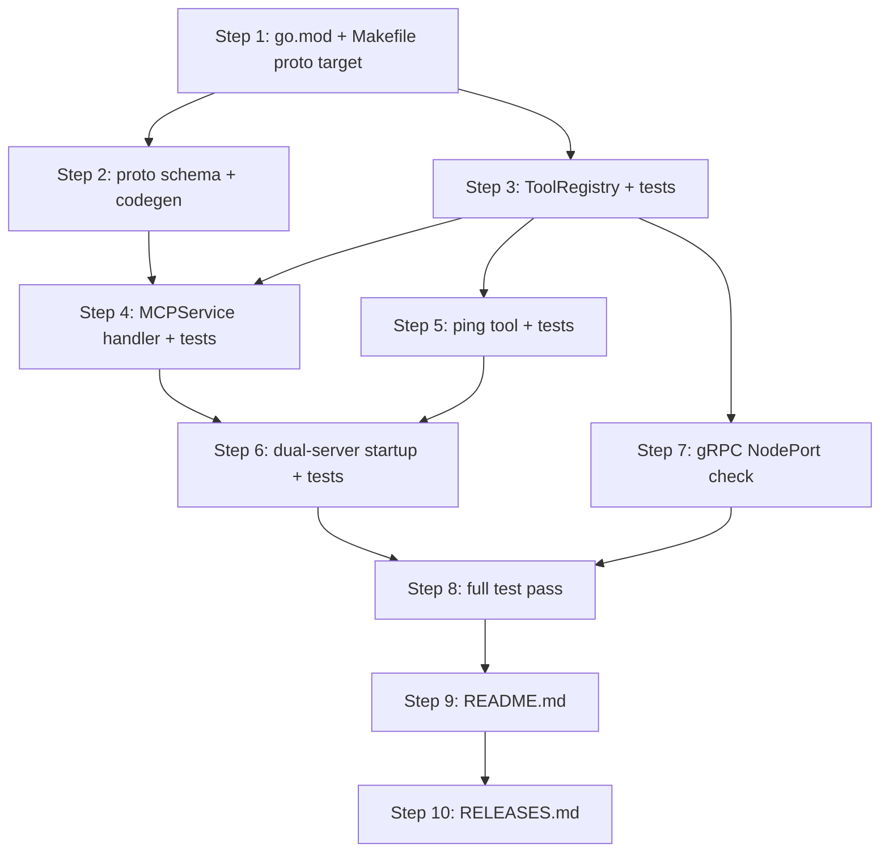

# Implementation Plan: gRPC tool registry service with ping diagnostic tool

**Sprint**: SP-004
**Created**: 2026-06-28
**Spec**: SPEC.md
**Status**: Ready for Implementation

## Summary

This plan delivers the core gRPC service layer of the MCP Server: a concurrent-safe `ToolRegistry` interface exposed via `MCPService` on port 50051, with `ListTools` and `InvokeTool` RPCs backed by the registry. The `ping` built-in diagnostic tool validates the full dispatch pipeline end-to-end. Together, these two requirements establish the foundation for all future tool interactions — whether from built-in handlers or NATS-discovered plugins.

## Entity Coverage

| Entity  | Type        | Partial | Scope                 |
|---------|-------------|---------|-----------------------|
| REQ-00A | requirement | no      | Full implementation   |
| REQ-00B | requirement | no      | Full implementation   |
| SC-013  | scenario    | no      | Full implementation   |
| SC-014  | scenario    | no      | Full implementation   |
| SC-015  | scenario    | no      | Full implementation   |
| SC-016  | scenario    | no      | Full implementation   |
| SC-017  | scenario    | no      | Full implementation   |
| SC-018  | scenario    | no      | Full implementation   |
| SC-019  | scenario    | no      | Full implementation   |

## Implementation Steps

### Step 1: Go module dependencies and Makefile proto target

**Description**: Add `google.golang.org/grpc` and `google.golang.org/protobuf` to `go.mod`/`go.sum` so that downstream steps can import generated gRPC stubs. Add the `proto` Makefile target that invokes `protoc` with `protoc-gen-go` and `protoc-gen-go-grpc` plugins, outputting generated Go code to `gen/proto/mcp/v1/`. Also add `golang.org/x/sync/errgroup` if not already present, since dual-server startup requires it. Document `protoc` and plugin prerequisites in a Makefile comment.

**Entities**: REQ-00A

**Files to modify**:
- `go.mod` (modify)
- `go.sum` (modify — generated by `go mod tidy`)
- `Makefile` (modify)

**Acceptance criteria**:
- [ ] `go.mod` declares `google.golang.org/grpc` as a direct dependency
- [ ] `go.mod` declares `google.golang.org/protobuf` as a direct dependency
- [ ] `go.mod` declares `golang.org/x/sync` as a direct dependency (for `errgroup`)
- [ ] `Makefile` contains a `proto` target that runs `protoc` with `--go_out` and `--go-grpc_out` pointing to `gen/proto/mcp/v1/`
- [ ] Makefile `proto` target includes a comment documenting the `protoc`, `protoc-gen-go`, and `protoc-gen-go-grpc` tool prerequisites
- [ ] `go build ./...` succeeds after `go mod tidy`

**Estimated complexity**: S

**Depends on**: None

**Test Expectations (from SPEC):**
- N/A — this step covers build infrastructure only; no test expectations are specified for module/Makefile changes.

**Testing Approach:** TDD

---

### Step 2: Protobuf schema definition and Go code generation

**Description**: Create `proto/mcp/v1/mcp.proto` defining the `MCPService` service with `ListTools` (empty request → `ListToolsResponse`) and `InvokeTool` (`InvokeToolRequest` → `InvokeToolResponse`) RPCs. Create the output directory `gen/proto/mcp/v1/` and run `make proto` to generate the Go stubs into it. The generated files are committed to the repository.

**Entities**: REQ-00A

**Files to modify**:
- `proto/mcp/v1/mcp.proto` (create)
- `gen/proto/mcp/v1/` (create — directory populated by `make proto`)

**Acceptance criteria**:
- [ ] `proto/mcp/v1/mcp.proto` defines `MCPService` with `ListTools` and `InvokeTool` RPCs
- [ ] `ListTools` RPC uses an empty request message and returns `ListToolsResponse` containing a repeated `ToolDescriptor` message with `name`, `description`, and `input_schema` fields
- [ ] `InvokeTool` RPC uses `InvokeToolRequest` with `tool_name` (string) and `input` (string, JSON-encoded) fields, and returns `InvokeToolResponse` with an `output` (string, JSON-encoded) field
- [ ] Running `make proto` generates `.pb.go` and `_grpc.pb.go` files under `gen/proto/mcp/v1/`
- [ ] Generated files compile without errors (`go build ./gen/...`)

**Estimated complexity**: S

**Depends on**: Step 1

**Test Expectations (from SPEC):**
- N/A — schema authoring and code generation; behavioral tests are in later steps.

**Testing Approach:** TDD

---

### Step 3: ToolRegistry interface and concurrent-safe implementation (with tests — TDD red phase)

**Description**: Create `internal/registry/registry.go` defining the `ToolRegistry` interface (`Register(tool Tool)`, `List() []Tool`, `Invoke(name string, input string) (string, error)`) and the `Tool` struct with `Name`, `Description`, `InputSchema`, and `Handler` fields. Implement the `sync.RWMutex`-backed struct (`MapRegistry`) satisfying the interface: `RLock` for `List` and `Invoke` lookups, `Lock` for `Register`. This step follows the TDD cycle: write failing tests in `internal/registry/registry_test.go` first, then implement until all pass.

**Entities**: REQ-00A, SC-017

**Files to modify**:
- `internal/registry/registry.go` (create)
- `internal/registry/registry_test.go` (create)

**Acceptance criteria**:
- [ ] `ToolRegistry` interface is exported and declares `Register`, `List`, and `Invoke` with the signatures noted above
- [ ] `MapRegistry` is the concrete implementation satisfying `ToolRegistry`
- [ ] `Register` stores the tool; subsequent `List` returns it with correct `Name`, `Description`, and `InputSchema`
- [ ] `Invoke` dispatches to the stored handler and returns its output; an unknown name returns a sentinel/typed not-found error
- [ ] `go test -race ./internal/registry/...` passes with zero data races
- [ ] `TestRegistry_Register_AddsToolToList` passes: after `Register`, `List` returns the tool with correct fields
- [ ] `TestRegistry_Invoke_DispatchesToHandler` passes: registered handler is called and its output returned
- [ ] `TestRegistry_Invoke_UnknownTool_ReturnsNotFound` passes: `Invoke` on an unregistered name returns a not-found error
- [ ] `TestRegistry_ConcurrentAccess_NoRace` passes: concurrent `Register`/`List`/`Invoke` goroutines under `sync.WaitGroup` with `-race`
- [ ] `TestRegistry_ConcurrentRegisterListInvoke_NoRace` passes: all three operation types exercised concurrently
- [ ] `TestRegistry_ConcurrentRegister_AllToolsVisible` passes: after concurrent `Register` calls complete, `List` returns all registered tools
- [ ] Each test case uses a fresh `MapRegistry` instance (no shared global state)

**Estimated complexity**: M

**Depends on**: Step 1

**Test Expectations (from SPEC):**
- Must test: `TestRegistry_Register_AddsToolToList` — after `Register`, `List` returns the registered tool with correct name, description, and input_schema
- Must test: `TestRegistry_Invoke_DispatchesToHandler` — given a registered tool with a known handler, `Invoke` returns the handler's output without error
- Must test: `TestRegistry_Invoke_UnknownTool_ReturnsNotFound` — given no tool named `"nonexistent"` is registered, `Invoke` returns an error mappable to gRPC `NOT_FOUND`
- Must test: `TestRegistry_ConcurrentAccess_NoRace` — concurrent `Register`, `List`, and `Invoke` calls pass `go test -race` with no data races detected (table-driven with `sync.WaitGroup` goroutines)
- Must test: `TestRegistry_ConcurrentRegisterListInvoke_NoRace` — launch goroutines for all three operations simultaneously under `sync.WaitGroup`, run with `-race` flag
- Must test: `TestRegistry_ConcurrentRegister_AllToolsVisible` — after concurrent `Register` calls complete, `List` returns all registered tools (no silent drops)
- Must NOT rely on: global registry state shared between test cases; use a fresh `ToolRegistry` instance per test case
- Must NOT rely on: sequential execution guarantees; test must exercise genuine concurrency with multiple goroutines per operation type

**Testing Approach:** TDD

---

### Step 4: MCPService gRPC handler (with tests — TDD red phase)

**Description**: Create `internal/mcp/service.go` implementing the generated `MCPServiceServer` interface. `MCPService` holds a `ToolRegistry` dependency (injected via constructor). `ListTools` delegates to `registry.List()` and maps each `Tool` to a `ToolDescriptor` proto message. `InvokeTool` delegates to `registry.Invoke()`; on not-found error it returns `status.Error(codes.NotFound, ...)` with the tool name in the message. Write tests in `internal/mcp/service_test.go` using a `bufconn` listener so tests exercise the real gRPC stack without a live network port. Follow TDD: write failing tests first, then implement.

**Entities**: REQ-00A, SC-014, SC-015, SC-016

**Files to modify**:
- `internal/mcp/service.go` (create)
- `internal/mcp/service_test.go` (create)

**Acceptance criteria**:
- [ ] `MCPService` is exported and satisfies the generated `MCPServiceServer` interface
- [ ] `MCPService` accepts a `ToolRegistry` via a constructor function (e.g., `NewMCPService(reg ToolRegistry) *MCPService`)
- [ ] `ListTools` returns a `ListToolsResponse` with one `ToolDescriptor` per registered tool, each with non-empty `name`, `description`, and `input_schema`
- [ ] `InvokeTool` with a valid tool name returns `InvokeToolResponse` with the handler's JSON output and gRPC status OK
- [ ] `InvokeTool` with an unregistered name returns gRPC status `codes.NotFound`; the error message contains the requested tool name
- [ ] `TestMCPService_ListTools_ReturnsDescriptors` passes: gRPC handler delegates to registry and returns well-formed `ListToolsResponse`
- [ ] `TestMCPService_ListTools_NonEmptyRegistryResponse` passes: registry with one known tool produces a non-empty list
- [ ] `TestMCPService_ListTools_DescriptorFields_ArePopulated` passes: every returned descriptor has non-empty `name`, non-empty `description`, and valid-JSON `input_schema`
- [ ] `TestMCPService_InvokeTool_ValidTool_ReturnsHandlerOutput` passes: valid tool name returns OK status and handler JSON output
- [ ] `TestMCPService_InvokeTool_OutputIsValidJSON` passes: `output` field parses as JSON
- [ ] `TestMCPService_InvokeTool_UnknownTool_ReturnsGRPCNotFound` passes: status code is `codes.NotFound`
- [ ] `TestMCPService_InvokeTool_UnknownTool_ReturnsNotFound` passes (handler translation)
- [ ] `TestMCPService_InvokeTool_ErrorMessage_ContainsToolName` passes: NOT_FOUND message contains the tool name string
- [ ] Tests use `bufconn` listener — no live network port required
- [ ] `go test ./internal/mcp/...` passes

**Estimated complexity**: M

**Depends on**: Step 2, Step 3

**Test Expectations (from SPEC):**
- Must test: `TestMCPService_ListTools_ReturnsDescriptors` — gRPC handler delegates to registry and returns well-formed `ListToolsResponse`
- Must test: `TestMCPService_InvokeTool_UnknownTool_ReturnsGRPCNotFound` — gRPC handler translates registry not-found error to gRPC `codes.NotFound` status
- Must test: `TestMCPService_ListTools_NonEmptyRegistryResponse` — with a registry containing one known tool, `ListTools` returns a response list with that tool's descriptor intact
- Must test: `TestMCPService_ListTools_DescriptorFields_ArePopulated` — every returned descriptor has non-empty `name`, non-empty `description`, and `input_schema` that is valid JSON
- Must test: `TestMCPService_InvokeTool_ValidTool_ReturnsHandlerOutput` — calling `InvokeTool` with a registered tool name returns OK status and the handler's JSON output
- Must test: `TestMCPService_InvokeTool_OutputIsValidJSON` — the `output` field in the response is parseable JSON
- Must test: `TestMCPService_InvokeTool_UnknownTool_ReturnsNotFound` — gRPC status code is `codes.NotFound` when tool name is not registered
- Must test: `TestMCPService_InvokeTool_ErrorMessage_ContainsToolName` — error message from the NOT_FOUND status contains the requested tool name
- Must NOT rely on: a live gRPC network connection in unit tests; use a test server via `grpc.NewServer()` bound to a `bufconn` listener
- Must NOT rely on: production handler side effects or real network calls in unit tests

**Testing Approach:** TDD

---

### Step 5: Ping tool handler (with tests — TDD red phase)

**Description**: Create `internal/tools/ping.go` implementing a ping handler that satisfies the handler signature defined by `ToolRegistry`. `NewTool()` returns a `Tool` with `Name: "ping"`, `Description: "Diagnostic tool that returns pong with server timestamp"`, `InputSchema: "{}"`, and a handler that marshals `{"message":"pong","timestamp":"<RFC3339>"}` using `time.Now().Format(time.RFC3339)`. Write tests in `internal/tools/ping_test.go` first (TDD), asserting message value, RFC 3339 format, timestamp window, and exact field count.

**Entities**: REQ-00B, SC-019

**Files to modify**:
- `internal/tools/ping.go` (create)
- `internal/tools/ping_test.go` (create)

**Acceptance criteria**:
- [ ] `internal/tools/ping.go` exists and the handler resides in the `tools` package
- [ ] `NewTool()` returns a `Tool` with `Name` equal to `"ping"`
- [ ] `NewTool()` returns a `Tool` with `Description` equal to `"Diagnostic tool that returns pong with server timestamp"`
- [ ] `NewTool()` returns a `Tool` with `InputSchema` equal to `"{}"` (empty JSON object, no required parameters)
- [ ] Handler output is valid JSON with exactly two fields: `message` and `timestamp`
- [ ] `message` field equals `"pong"`
- [ ] `timestamp` field is a valid RFC 3339 string that parses via `time.Parse(time.RFC3339, ...)`
- [ ] `timestamp` falls within a [T1, T2] window recorded around the invocation with 1-second tolerance
- [ ] `TestPingHandler_Invoke_ReturnsPongMessage` passes
- [ ] `TestPingHandler_Invoke_TimestampIsRFC3339` passes
- [ ] `TestPingHandler_Invoke_OutputIsValidJSON` passes
- [ ] `TestPingHandler_Invoke_OutputHasExactlyTwoFields` passes
- [ ] `TestPingHandler_Invoke_TimestampWithinWindow` passes
- [ ] `TestPingTool_Descriptor_Name` passes
- [ ] `TestPingTool_Descriptor_Description` passes
- [ ] `TestPingTool_Descriptor_InputSchema_NoRequiredParams` passes
- [ ] Tests use time window comparison — no fixed/hardcoded timestamp strings
- [ ] `go test ./internal/tools/...` passes

**Estimated complexity**: S

**Depends on**: Step 3

**Test Expectations (from SPEC):**
- Must test: `TestPingHandler_Invoke_ReturnsPongMessage` — handler returns JSON with `message` equal to `"pong"`
- Must test: `TestPingHandler_Invoke_TimestampIsRFC3339` — the `timestamp` field in the response parses successfully as RFC 3339 and falls within a reasonable window of the invocation time
- Must test: `TestPingHandler_Invoke_OutputIsValidJSON` — handler output is valid JSON (no marshal error, no extra fields beyond `message` and `timestamp`)
- Must test: `TestPingTool_Descriptor_Name` — tool name equals `"ping"`
- Must test: `TestPingTool_Descriptor_Description` — description equals `"Diagnostic tool that returns pong with server timestamp"`
- Must test: `TestPingTool_Descriptor_InputSchema_NoRequiredParams` — input schema is the empty JSON object schema with no required fields
- Must test: `TestPingHandler_Invoke_MessageIsPong` — output JSON `message` field equals `"pong"`
- Must test: `TestPingHandler_Invoke_TimestampParsesAsRFC3339` — `time.Parse(time.RFC3339, timestamp)` succeeds without error
- Must test: `TestPingHandler_Invoke_TimestampWithinWindow` — parsed timestamp is between T1 and T2 recorded around the invocation, with 1 second tolerance
- Must test: `TestPingHandler_Invoke_OutputHasExactlyTwoFields` — the output JSON object contains exactly `message` and `timestamp`, no additional fields
- Must NOT rely on: fixed/hardcoded timestamps in assertions; use time window comparison (`T1 <= parsed <= T2`) instead

**Testing Approach:** TDD

---

### Step 6: Dual-server startup, grpc-port flag, and graceful shutdown (with tests — TDD red phase)

**Description**: Extend `cmd/eve-realm-mcp/main.go` to add a `--grpc-port` flag (default 50051), start an `errgroup`-managed gRPC server alongside the existing HTTP server, and extend graceful shutdown to cover both servers. The gRPC server is created via `grpc.NewServer()`, `MCPService` is registered on it, and the ping tool is registered in the `ToolRegistry` before `grpc.Serve()` is called. Write process-level or in-process tests asserting both servers bind their ports, the port flag override works, and the startup log includes the gRPC listen port.

**Entities**: REQ-00A, REQ-00B, SC-013, SC-018

**Files to modify**:
- `cmd/eve-realm-mcp/main.go` (modify)
- `cmd/eve-realm-mcp/main_test.go` (modify)

**Acceptance criteria**:
- [ ] `--grpc-port` flag exists with default value `50051`; existing `--port` flag is unchanged (HTTP default 8080)
- [ ] Without flags: HTTP server listens on 8080, gRPC server listens on 50051
- [ ] With `--grpc-port 9090`: gRPC server listens on 9090, HTTP server stays on 8080
- [ ] Startup log includes the gRPC listen port (e.g., `"grpc listening on :50051"`)
- [ ] `ping` tool is registered in the `ToolRegistry` before `grpc.Serve()` is called
- [ ] Graceful shutdown covers both HTTP and gRPC servers (no orphaned goroutines)
- [ ] `TestServer_DefaultPorts_BothServersListen` passes: both 8080 and 50051 bind when started without flags
- [ ] `TestServer_GRPCPortFlag_Override` / `TestServer_GRPCPortFlag_OverridesDefault` passes: `--grpc-port 9090` binds gRPC on 9090
- [ ] `TestServer_StartupLog_IncludesGRPCPort` passes: startup log output contains the gRPC listen port
- [ ] `TestStartup_PingToolRegistered_InListTools` passes: `ListTools` response contains the `ping` descriptor after server initialization
- [ ] Tests do not use sleep-based polling; use retry-with-timeout or readiness signaling
- [ ] `go test ./cmd/eve-realm-mcp/...` passes (including existing tests, which must not regress)

**Estimated complexity**: M

**Depends on**: Step 4, Step 5

**Test Expectations (from SPEC):**
- Must test: `TestServer_GRPCPortFlag_Override` — process substitution test verifying gRPC server binds to the port specified by `--grpc-port`
- Must test: `TestServer_DefaultPorts_BothServersListen` — process substitution test verifying the server binary binds both 8080 (HTTP) and 50051 (gRPC) when started without flags
- Must test: `TestServer_GRPCPortFlag_OverridesDefault` — process substitution test verifying `--grpc-port 9090` causes gRPC to bind on 9090 while HTTP stays on 8080
- Must test: `TestServer_StartupLog_IncludesGRPCPort` — startup log output contains the gRPC listen port
- Must test: `TestStartup_PingToolRegistered_InListTools` — process-level or in-process test verifying `ListTools` response contains the `ping` descriptor after server initialization
- Must test: `TestPingTool_Descriptor_MatchesSpec` — unit test verifying the tool's `name`, `description`, and `input_schema` match the specified values exactly
- Must NOT rely on: sleep-based port polling; use retry-with-timeout or readiness signaling
- Must NOT rely on: polling or sleep-based startup detection; use server readiness signaling

**Testing Approach:** TDD

---

### Step 7: gRPC NodePort connectivity check in cluster verification

**Description**: Add a `CheckGRPCNodePort` check function to `deploy/k8s/verify/checks.go` that verifies the gRPC endpoint at `localhost:30051` is reachable (per REQ-003 cluster integration testing policy triggered by the new NodePort gRPC service). Register it in the `Checks` slice under category `"grpc"`. Add corresponding tests to `deploy/k8s/verify/checks_test.go`. Update the `TestChecks_AllRegistered` test to expect 6 checks instead of 5.

**Entities**: REQ-00A

**Files to modify**:
- `deploy/k8s/verify/checks.go` (modify)
- `deploy/k8s/verify/checks_test.go` (modify)

**Acceptance criteria**:
- [ ] `CheckGRPCNodePort` function exists in the `verify` package, accepts a client interface suitable for TCP/gRPC reachability checks, and returns a `CheckResult` with `Category: "grpc"` and `Name: "grpc-nodeport"`
- [ ] When the gRPC endpoint at `localhost:30051` is reachable, the check returns `Passed: true`
- [ ] When the endpoint is unreachable, the check returns `Passed: false` with a descriptive message referencing `localhost:30051`
- [ ] `CheckGRPCNodePort` is registered in the `Checks` slice
- [ ] `TestChecks_AllRegistered` is updated to expect 6 checks
- [ ] `TestChecks_CategoryCounts` is updated to include `grpc: 1`
- [ ] Tests for `CheckGRPCNodePort` cover success, connection-refused, and timeout failure cases
- [ ] `go test ./deploy/k8s/verify/...` passes (all existing tests continue to pass)

**Estimated complexity**: S

**Depends on**: Step 3

**Test Expectations (from SPEC):**
- N/A — REQ-003 cluster integration testing policy mandates a check function; specific test names are not prescribed in the spec's Test Expectations for this check.

**Testing Approach:** TDD

---

### Step 8: Full integration test pass and race-detection verification

**Description**: Run the full test suite with race detection enabled (`go test -race -count=1 ./...`) to confirm all unit tests pass, no data races exist across the registry, MCPService, ping handler, and startup wiring. Verify that the `make build` target compiles the binary successfully with all new imports wired. This is a verification step — no new production code is written.

**Entities**: REQ-00A, REQ-00B, SC-013, SC-014, SC-015, SC-016, SC-017, SC-018, SC-019

**Files to modify**:
- N/A (verification only)

**Acceptance criteria**:
- [ ] `go test -race -count=1 ./...` exits 0 with no test failures
- [ ] No data race reports appear in the output
- [ ] `make build` succeeds, producing a compilable binary
- [ ] All test functions named in the spec's Test Expectations are present and pass:
  - `TestRegistry_Register_AddsToolToList`
  - `TestRegistry_Invoke_DispatchesToHandler`
  - `TestRegistry_Invoke_UnknownTool_ReturnsNotFound`
  - `TestRegistry_ConcurrentAccess_NoRace`
  - `TestMCPService_ListTools_ReturnsDescriptors`
  - `TestMCPService_InvokeTool_UnknownTool_ReturnsGRPCNotFound`
  - `TestPingHandler_Invoke_ReturnsPongMessage`
  - `TestPingHandler_Invoke_TimestampIsRFC3339`
  - `TestPingHandler_Invoke_OutputIsValidJSON`
  - `TestServer_GRPCPortFlag_Override`

**Estimated complexity**: S

**Depends on**: Step 6, Step 7

---

### Step 9: README.md Update

**Description**: Update `README.md` to reflect user-facing changes delivered in this sprint. Document the new `--grpc-port` flag, the gRPC endpoint on port 50051 (NodePort 30051 in the local k3d cluster), the `MCPService` operations (`ListTools`, `InvokeTool`), the `ping` built-in diagnostic tool with its invocation and response format, and the `make proto` target for code generation.

**Entities**: REQ-00A, REQ-00B

**Files to modify**:
- `README.md` (modify)

**Acceptance criteria**:
- [ ] README.md documents the `--grpc-port` flag with its default value of 50051
- [ ] README.md describes the gRPC endpoint on port 50051 and NodePort 30051 for local k3d access
- [ ] README.md lists `ListTools` and `InvokeTool` as available gRPC operations under `MCPService`
- [ ] README.md documents the `ping` diagnostic tool: invocation (`InvokeTool(tool_name: "ping")`), response format (`{"message":"pong","timestamp":"<RFC3339>"}`), and its purpose
- [ ] README.md documents the `make proto` target and notes the `protoc`/plugin prerequisites
- [ ] README.md is consistent with the implementation (port numbers, flag names, JSON shapes match the code)

**Estimated complexity**: S

**Depends on**: Step 8

---

### Step 10: RELEASES.md Append

**Description**: Append a release entry to `RELEASES.md` documenting the SP-004 delivery. The entry captures the sprint ID and title, date of completion, summary of changes (gRPC `MCPService` on port 50051, concurrent-safe `ToolRegistry`, `proto/mcp/v1/mcp.proto`, `make proto` code generation, `ping` built-in tool, K8s Service NodePort 30051), and all entity IDs included in this sprint.

**Entities**: REQ-00A, REQ-00B, SC-013, SC-014, SC-015, SC-016, SC-017, SC-018, SC-019

**Files to modify**:
- `RELEASES.md` (modify)

**Acceptance criteria**:
- [ ] `RELEASES.md` has a new entry with sprint ID `SP-004` and the completion date
- [ ] Entry title is `"gRPC tool registry service with ping diagnostic tool"`
- [ ] Entry lists all entity IDs: REQ-00A, REQ-00B, SC-013, SC-014, SC-015, SC-016, SC-017, SC-018, SC-019
- [ ] Entry summarizes in 2-3 sentences: gRPC MCPService on port 50051, concurrent-safe ToolRegistry, ping diagnostic tool, K8s NodePort 30051
- [ ] Existing entries in `RELEASES.md` are not modified

**Estimated complexity**: S

**Depends on**: Step 9

---

## Step Dependency Graph

---

## Pinned Entity Compliance

| Entity | Directive | How Addressed |
|--------|-----------|---------------|
| REQ-005: Cross-cutting requirements catalog for lazy-loaded sprint policy injection | No plan-phase directive in REQ-005 body itself. The catalog triggers four cross-cutting requirements. REQ-001 (TDD): plan must propagate Test Expectations to each implementation step and annotate testing approach; test steps must be interleaved TDD-style (red before green). REQ-002 (release): plan must include a RELEASES.md step as the final step. REQ-003 (cluster integration testing): plan must add a verification step for the new gRPC NodePort check in `deploy/k8s/verify/checks.go`. REQ-004 (k3d topology): plan must reference NodePort 30051 and the `eve-realm` namespace correctly in all cluster-facing steps. | Test Expectations from SPEC.md are copied verbatim into each implementation step that addresses the relevant entity (Steps 3–7). Each implementation step is annotated with `Testing Approach: TDD`. Step ordering follows interleaved TDD: test file written alongside production code in the same step (red→green cycle per step). Step 7 adds the `CheckGRPCNodePort` function to `deploy/k8s/verify/checks.go` per REQ-003. Step 10 (RELEASES.md) is the final step per REQ-002. NodePort 30051 and namespace `eve-realm` are referenced accurately in Steps 6, 7, and 9 per REQ-004. |
